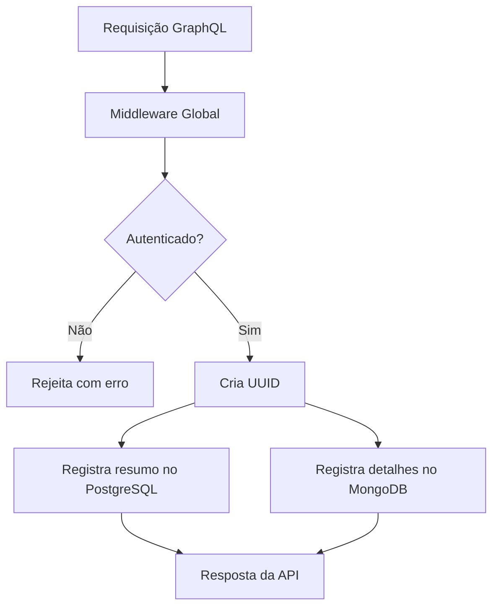

# ADR [0012]: Auditoria Híbrida de Ações GraphQL com PostgreSQL + MongoDB

## Status
Aceito

## Contexto
A aplicação utiliza GraphQL como interface principal de comunicação entre frontend e backend. Por questões de rastreabilidade, segurança e geração de relatórios, tornou-se necessário registrar as ações executadas pelos usuários.

Inicialmente, considerou-se registrar tudo em um único banco relacional (PostgreSQL), mas isso poderia impactar o desempenho da aplicação devido ao volume elevado e estrutura variável dos dados envolvidos.

Ao mesmo tempo, registrar tudo apenas no MongoDB traria dificuldade para consultas analíticas simples, como filtros por usuário, operação ou data.

Diante disso, foi adotado um modelo híbrido que equilibra performance, flexibilidade e controle analítico.

## Decisão
Foi adotada a arquitetura de auditoria baseada em dois níveis de persistência:

- **PostgreSQL** armazena o registro mínimo necessário para relatórios e rastreamento:
  - `user_id`
  - `email`
  - `operation`
  - `module`
  - `ip`
  - `status`
  - `timestamp`
  - `uuid` (chave de correlação com o Mongo)

- **MongoDB** armazena o detalhamento completo da execução:
  - query completa
  - variáveis
  - headers
  - resposta (quando necessário)
  - payloads dinâmicos

A identificação entre os registros será feita por um UUID único gerado no início da execução.

Um middleware global será responsável por:
- interceptar a execução GraphQL
- registrar os dados no PostgreSQL
- enviar os dados complementares para o MongoDB

## Consequências
- Possibilidade de gerar relatórios e filtros rapidamente com queries SQL simples
- Flexibilidade para armazenar dados dinâmicos e complexos no MongoDB sem afetar a performance
- Escalabilidade garantida em projetos de alto volume
- Facilidade de correlação entre os bancos usando UUID

## Diagrama (Mermaid)

