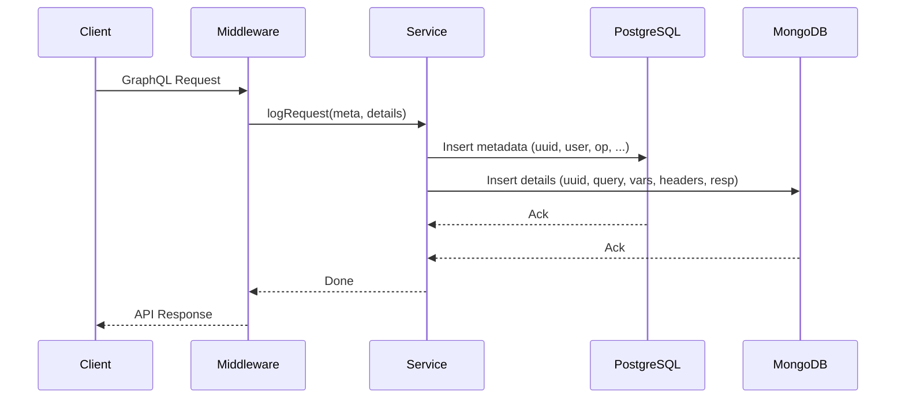

# Security Module – Hybrid GraphQL Audit Logging

## Overview
This module implements a transparent, hybrid audit logging system for all GraphQL operations. It uses a global middleware to capture every GraphQL request, storing metadata in PostgreSQL and detailed request/response data in MongoDB. This ensures traceability, performance, and scalability, with no changes required in resolvers or frontend code.

## Architecture
- **Middleware:** `GraphQLAuditLogger` intercepts all GraphQL requests, collects metadata and details, and delegates logging to the service layer.
- **Service:** `AuditLoggerService` orchestrates the persistence of metadata (PostgreSQL) and details (MongoDB).
- **Model:** `AuditLog` Eloquent model for the `graphql_audit_logs` table.
- **Repository:** `AuditLogMongoRepository` for MongoDB operations.

## Flow Diagram (Mermaid)



## Example Queries
```graphql
# List audit logs (PostgreSQL)
query {
  auditLogs(userId: 1) {
    id
    operation
    createdAt
    uuid
  }
}

# Get audit log details (MongoDB)
query {
  auditLogDetails(uuid: "<uuid>") {
    variables
    fullQuery
    headers
    response
  }
}
```

## How It Works
1. **Request Interception:** Middleware captures every GraphQL request.
2. **Metadata Logging:** Metadata (user, operation, status, etc.) is saved in PostgreSQL.
3. **Detail Logging:** Full query, variables, headers, and response are saved in MongoDB.
4. **Correlation:** Both records are linked by a shared UUID.

## Benefits
- **Transparency:** No changes needed in resolvers or frontend.
- **Performance:** Only metadata in SQL; heavy details in NoSQL.
- **Scalability:** MongoDB handles large, unstructured audit data.

## Developer Instructions
- Middleware is globally registered in `app/Http/Kernel.php`.
- All logic and tests are inside the Security module.
- To query logs, use the provided GraphQL queries in the Playground.

## Related Files
- `Http/Middleware/GraphQLAuditLogger.php`
- `Services/AuditLoggerService.php`
- `Services/AuditLogMongoRepository.php`
- `Models/AuditLog.php`
- `Database/Migrations/2025_05_21_000000_create_graphql_audit_logs_table.php`

## Test Coverage
- Unit tests for middleware and service in `Tests/Unit/`
- Always run the full test suite after changes:
  ```bash
  cd ../realestate-infra && docker compose exec app php artisan test
  ```

## References
- See `doc/architectural-decision-records/0012-auditoria-hibrida-graphql.md` for ADR details.
